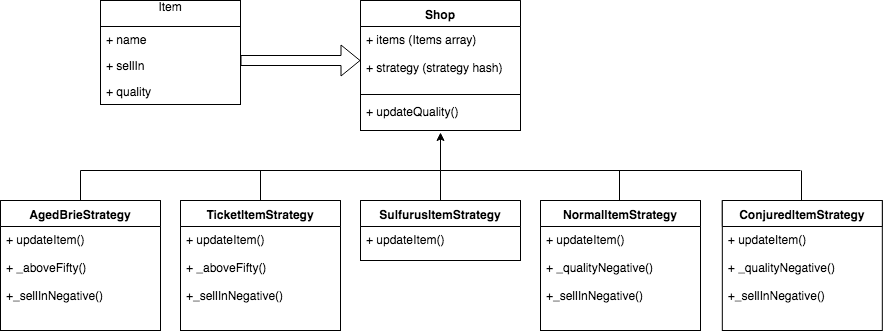

# Gilded Rose JS

[](https://travis-ci.org/JohnNewman1/GildedRoseTake2)

[](https://bettercodehub.com/)

This project was set by Makers Academy as a practise tech test.

The goal of this tech test was to take the legacy code of GildedRose, add a new feature and refactor the code. The main challenge is that the Item class can not be changed.

### Specification

https://github.com/emilybache/GildedRose-Refactoring-Kata/blob/master/GildedRoseRequirements.txt

### Planning

Before starting the project I noted out some brief plans to best tackle the problem.

- A Full feature test for the legacy code provided by Gilded Rose covering all cases
- Add the new feature for conjuring items to the original code
- Research different techniques to refactor the code
- Implement the technique using TDD and make sure all feature tests still pass

### Installation and use

1. Fork and clone the repository
2. Open ``GildedRose.html`` in the browser

### Approach

I have taken a interest in design patterns and wanted to implement this kata using one. I looked at using class inheritance and the strategy pattern:

**Class inheritance**

Allows class properties and behaviours to be extended and reused. This will keep your code DRY and allow you to specify a new implementation of a similar class.

To Implement this I would create new classes for all the different items by extending the Item class and adding a different update method depending on the specifications.

**Strategy Pattern**

This is implemented by creating different methods depending on a case. This case is checked at run time and the correct method is called. This allows for easy adaption and much smaller methods.

I would create a new class for each of the different items which would be initialised in the Shop class depending on its name.

I planned to use the strategy pattern as I believed using inheritance went against the Specification to not change the Item class. By extending it I would be able to change the code to how I wanted and override the properties and behaviours.

### UML Diagram



### Code Snippet

Shop Class

```
class Shop {
  constructor(items=[], obj){
    this.items = items;
    this.strategy = obj || {
      "Sulfuras, Hand of Ragnaros": new SulfurasItemStrategy(),
      "Conjured Mana Cake": new ConjuredItemStrategy(),
      "Backstage passes to a TAFKAL80ETC concert": new TicketItemStrategy(),
      "Aged Brie": new AgedBrieStrategy()
    }
  }

    updateQuality(){
      this.items.forEach(function(item){
        var strategy = this.strategy[item.name] || new NormalItemStrategy();
        strategy.updateItem(item);
      }.bind(this))
    }
}
```

### Improvements

- Error handling when entering new items
- Adding a Item type to run strategy methods rather than using their names

### Technology

- Javascript
- Node.js
- Jquery
- HTML

### Testing

Testing the legacy code was difficult due to all the different branches and possibilities.

When refactoring I was able to test drive my code by unit testing. Development this way was a lot better and less time consuming.

To run the following in the command line
 ```
 npm install
 npm run test
 ```

 Test Coverage - Istanbul
